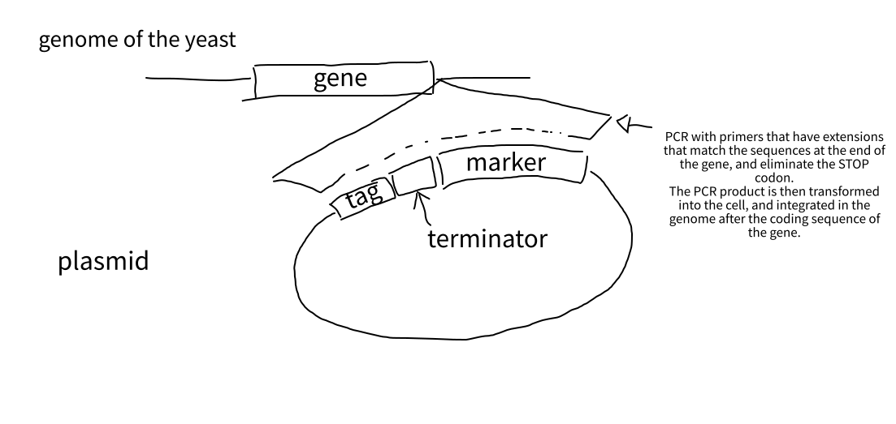

# Patterns

Patterns that can be found in allele descriptions, and what they mean. For now just for _S. pombe_:

* `GENE-TAG-MARKER`:
  * Common in labs that do microscopy or biochemistry / study physical interactions of proteins.
  * Tagging a gene consists of the addition of a DNA fragment that codes a "protein tag". When the gene is transcribed, the tag fragment gets transcribed as well and it is added to the mRNA.
  * When the mRNA is translated the tag is also translated, so the resulting protein contains an additional chunk that we call 'tag'.
  * Some important things that might not be obvious:
    * Tags can be at the N-terminus (before the coding sequence of the gene starts) or after the C-terminus of the protein (after the coding sequence of the gene ends). Sometimes they are in the middle, but that's very rare.
    * Typically, in _S. pombe_ most tags are added at the C-term. The reason for it is that it is very easy to do it genetically, we can amplify
    
    
